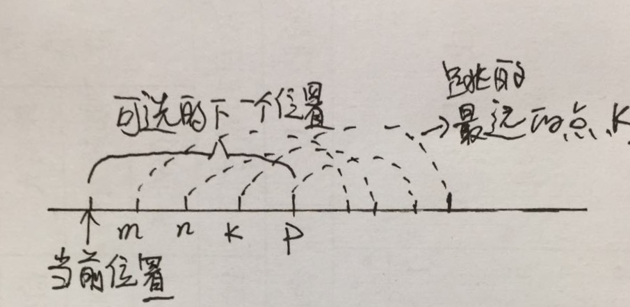

## NO.45 Jump Game II

- Problem
 Given an array of non-negative integers, you are initially positioned at the first index of the array.
 
 Each element in the array represents your maximum jump length at that position.
 
 Your goal is to reach the last index in the minimum number of jumps.
 
 For example:
 Given array A = [2,3,1,1,4]
 
 The minimum number of jumps to reach the last index is 2. (Jump 1 step from index 0 to 1, then 3 steps to the last index.)
 
 Note:
 You can assume that you can always reach the last index.
 
- 思路
使用贪心算法求解，每次选择下一个跳点k时应该在所有可选的下一个跳点中选出在下一个跳点时跳的最远的那个。因为在下一个跳点时， k能够覆盖的范围是最远的，因此其选择范围是包含其他跳点能够到达的范围，则最优解仍在选择范围内。另外由于每次选择的下一点是能够跳的最远的那一点，所以最终跳的次数是最少的。


- 实现
```
class Solution {
public:
    int jump(vector<int>& nums) {
        int step = 0, curPos = 0;
        while(curPos < nums.size() - 1)
        {
            int nextPos = -1;
            if(nums[curPos] + curPos >= nums.size() - 1)
                nextPos = nums.size() - 1;
            else
            {
                for(int i = 1; i <= nums[curPos]; ++i)
                {
                    if(nextPos == -1)
                        nextPos = curPos + i;
                    else if((nums[curPos + i] + i) > (nums[nextPos] + nextPos - curPos))
                        nextPos = curPos + i;
                    if(nextPos >= nums.size() - 1)
                        break;
                }
            }
            curPos = nextPos;
            ++step;
        }
        
        return step;
    }
};
```


